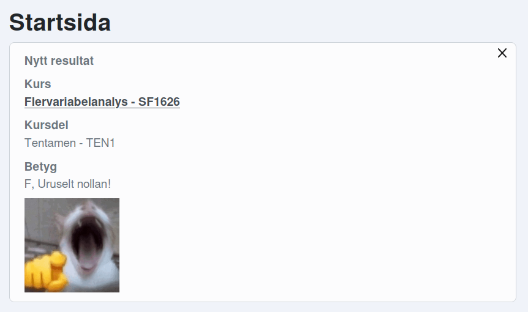

# Live Ladok reaction [BROKEN]
> [!NOTE]
> I suck at web developement, apparently ladok blocks "csp" so i cant load my own images, also i suspect the script ran too early again so it didnt even change the text. Sorry for hypig this up in advande, i really thaught it would work on the real site and not just the cache i used for developement :,(

Have you ever failed a course only to think "Man, I wish this was more humiliating". Well then you're in luck! Introducing the live Ladok reaction, an extension (really just a script) that adds a GIF of a cat laughing hysterically at you in case you fail a course or test in Ladok. See figure 1 for an example screenshot.

Figure 1: The F students are inventors.

Additional features include changing the text from "Underkänd" to "Uruselt nollan!" as well as displaying the [high five](https://youtu.be/HPdURyombM0) GIF from Breaking bad if you do pass. You probably won't be seeing that last feature though (🤣🫵🥀). Also, all of this is still kinda beta testing, I can't know for sure if it even works untill next time I get test results lol.

## Installation
Since I was too lazy to make this into a real extension, you will have to import it (the contents of main.js) to your browser using a userscript manager like Greasemonkey, there are many other better tutorials on how to do this. Please do note that this script was written for the Swedish version of Ladok. You will have to edit the code slightly for it to work in other languages.
